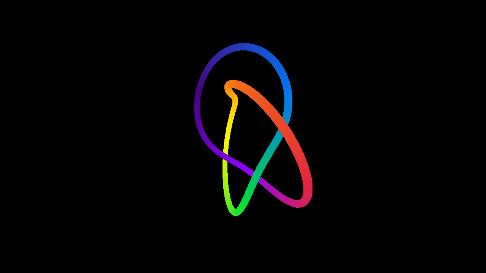
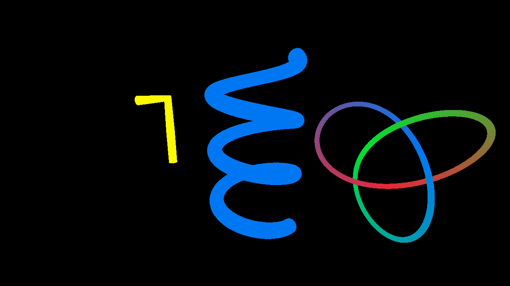
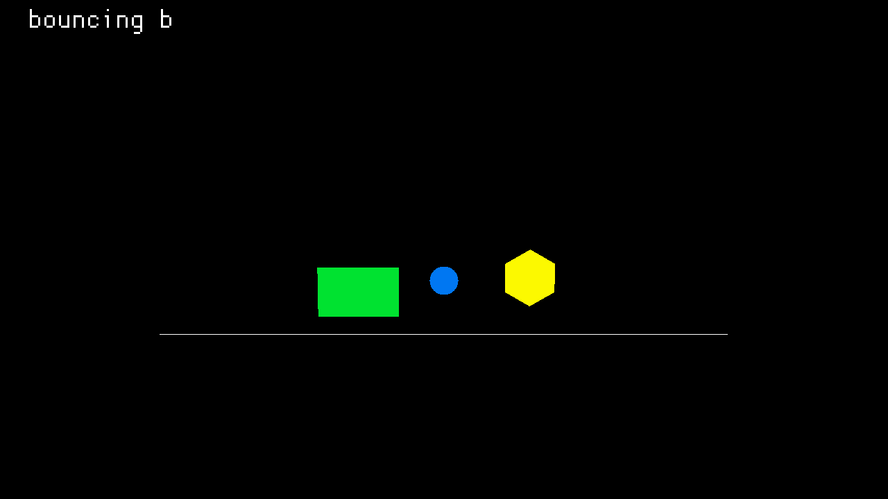
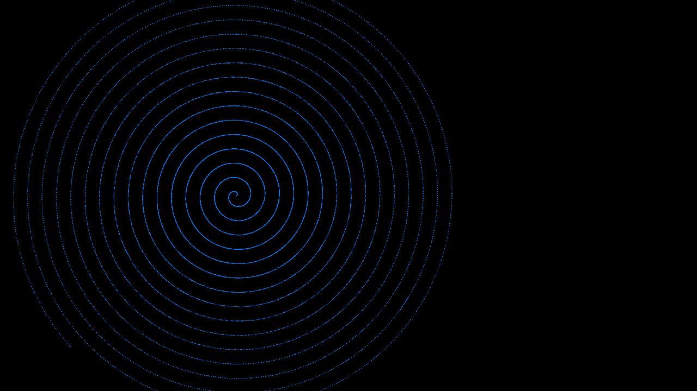
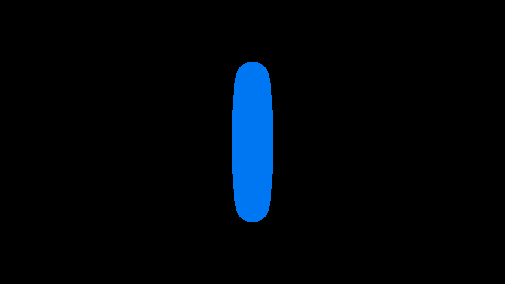

# rs-namin

A [Manim](https://www.manim.community/)-inspired animation engine in Rust, built on [macroquad](https://github.com/not-fl3/macroquad). Create programmatic 3D animations with keyframe-driven timelines, easing functions, and camera control, then preview interactively or export to MP4.



## Gallery

<p align="center">
  
  
</p>
<p align="center">
  
  
</p>

## Quick start

```bash
# Interactive viewer (default scene)
cargo run

# Run a built-in example
cargo run --bin example

# Snapshot a scene to PNG
cargo run --bin snapshot -- --scene bouncing_ball --time 1.5

# Export to MP4 (requires ffmpeg)
cargo run --bin export
```

## Building a scene

Scenes are built by creating objects, adding them to a scene, and defining animation tracks on a timeline.

```rust
use macroquad::prelude::*;
use rs_namin::animation::easing::quad_out;
use rs_namin::animation::timeline::Timeline;
use rs_namin::animation::track::{Keyframe, Track};
use rs_namin::camera::Camera;
use rs_namin::scene::Scene;
use rs_namin::scene::objects::Disk;
use rs_namin::scene::value::AnimValue;

pub fn build() -> (Scene, Timeline, Camera) {
    let mut scene = Scene::new();

    // Add a blue disk
    let disk_id = scene.add(Disk::new(vec3(0.0, 0.5, 0.0), 0.5, BLUE));

    // Animate it bouncing up and down
    let mut timeline = Timeline::new();
    let mut track = Track::new(disk_id, "position");
    track.add_keyframe(Keyframe::with_easing(
        0.0,
        AnimValue::Vec3(vec3(0.0, 0.5, 0.0)),
        quad_out,
    ));
    track.add_keyframe(Keyframe::new(
        1.0,
        AnimValue::Vec3(vec3(0.0, 5.0, 0.0)),
    ));
    timeline.add_track(track);

    let camera = Camera::new(vec3(0.0, 3.0, 15.0), Vec3::ZERO);
    (scene, timeline, camera)
}
```

A `SceneBuilder` API is also available for validated scene construction:

```rust
use rs_namin::scene_builder::SceneBuilder;

let mut sb = SceneBuilder::new();
let disk = sb.add(Disk::new(Vec3::ZERO, 1.0, RED));
sb.animate(&disk, "radius", |tb| {
    tb.keyframe(0.0, AnimValue::Float(1.0))
      .keyframe_with_easing(2.0, AnimValue::Float(3.0), quad_out)
});
let (scene, timeline, camera) = sb.build();
```

`SceneBuilder` validates property names and animation value types at construction time, panicking with descriptive errors on mismatches.

## Scene objects

See `src/scene/objects/` for the full list (16 object types, e.g. `Disk`, `Ring`, `Line`, `Rectangle`, `Polygon`, `Arc`, `Arrow`, `Spiral`, `Torus`, `Tube`, `VectorText`, `LSystem`, `Polyline`, `Sprite`, `Turtle`) and `Text` for screen-space overlays.

Most world-space objects are rendered as flat custom meshes via `draw_mesh` on the XY plane. Exceptions: `Line` uses `draw_line_3d`; `Torus`/`Tube` are true 3D meshes; `Sprite` is a textured quad. Screen-space objects (like `Text`) render in pixel coordinates after the 3D camera pass.

## Animation

Animations are driven by **tracks** on a **timeline**. Each track targets a single property on a single object (or the camera).

- **28 easing functions**: linear, quad, cubic, quart, quint, sine, expo, back, elastic, bounce -- each with in/out/in-out variants
- **Animatable types**: `Float`, `Vec2`, `Vec3`, `Vec4`, `Bool`, `Mat4`, `Transform2D`
- **Camera animation**: position, target, up, fov, near, far, rotation_x/y/z

## Interactive viewer

The default binary opens an interactive viewer with:

- **Orbit camera**: middle-click drag to orbit, right-click drag to pan, WASD/QE to move, scroll to zoom
- **Playback controls**: Space (play/pause), Left/Right (step frame), Up/Down (speed)
- **Debug overlays**: F1 (HUD), F2 (scrub bar), F3 (value inspector), F4 (world helpers), F6 (mouse coords)
- **Snap-to-view**: Numpad 1/3/7 for front/right/top
- **Camera mode toggle** (F5): switch between orbit control and timeline-driven camera

## Binaries

| Binary | Command | Purpose |
|--------|---------|---------|
| `rs-namin` | `cargo run` | Interactive viewer |
| `example` | `cargo run --bin example` | Example scene picker |
| `export` | `cargo run --bin export` | MP4 export via ffmpeg |
| `snapshot` | `cargo run --bin snapshot` | PNG frame capture |

### Snapshot options

```
--scene NAME          Scene to render (default: my_scene)
--time T              Single frame at time T
--times T1,T2,...     Multiple frames
--width W --height H  Resolution (default: 1280x720)
--output PATH         Output path (default: snapshot.png)
```

## Development

### Setup

```bash
git clone https://github.com/16dprice/rs-namin.git
cd rs-namin
git config core.hooksPath .githooks   # activate pre-commit hook
```

### Validation

A pre-commit hook automatically runs formatting, linting, and tests on every commit. You can also run it manually:

```bash
./scripts/validate.sh
```

This runs `cargo fmt --check`, `cargo clippy -- -D warnings`, and `cargo test`.

## Dependencies

- [macroquad](https://github.com/not-fl3/macroquad) -- rendering and windowing
- [image](https://github.com/image-rs/image) -- PNG encoding for snapshots
- [lyon](https://github.com/nical/lyon) -- bezier tessellation for `VectorText`
- [ttf-parser](https://github.com/RazrFalcon/ttf-parser) -- glyph outline extraction for `VectorText`
- [inquire](https://github.com/mikaelmello/inquire) -- interactive pickers in `example`/`export`
- [indicatif](https://github.com/console-rs/indicatif) -- progress bars for `export`
- [ffmpeg](https://ffmpeg.org/) -- required at runtime for MP4 export
- `latex` + `dvisvgm` -- required at runtime for `VectorText::from_latex` (Debian/Ubuntu: `texlive-base`, `texlive-latex-extra`, `dvisvgm`)
